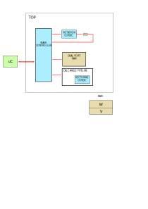

# FPGA-Jacobi

## Install

- 'pip install pipenv'
- go to main project directory and run 'pipenv shell'
- go to model and run 'pipenv install fpgajacobi --skip-lock'
- pipenv jupyter lab

## Project hierarchy

- 'model' : python fxp model of algorithm
- 'docs'  : documentation, drawings, etc..
- 'rtl'   : register tranfer level code 
- 'verif' : systemverilog verification of given circuit

## Circuit main schematic

- 
